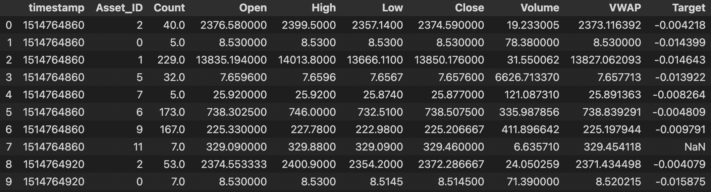
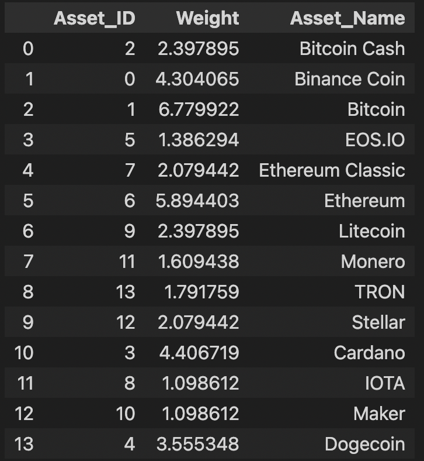

# Kaggle competition: [G-Research Crypto Forecasting](https://www.kaggle.com/c/g-research-crypto-forecasting/overview)

The simultaneous activity of thousands of traders ensures that most **signals** will be transitory, persistent **alpha** will be exceptionally difficult to find, and the danger of **overfitting** will be considerable. In addition, since 2018, interest in the cryptomarket has exploded, so the **volatility** and **correlation structure** in our data are likely to be highly non-stationary. The successful contestant will pay careful attention to these considerations, and in the process gain valuable insight into the art and science of financial forecasting.

## Github file info (updating)
- `./script/`: temporarily private scripts folder.

### Statistical Inference
- `statistical-analysis-additional.ipynb`: explore the crypto market by 
    - frequency manipulation `script/morestates.py -> ts_with_frequency()`
    - autocorrelation
    - time-series decomposition `script/morestates.py -> ts_decomp()`
    - stationarity tests `Augmented Dickey-Fuller test` 

### Neural Network Forecasting

- `RNN_forecasting.ipynb`: Do RNN forecasting on the BTC OHLCV info.
    - Tensorflow
    - Keras: `tensorflow.keras`
    - RNN-LSTM: `tensorflow.keras.layers.LSTM`

### Trading Strategy
- `MA_cross_strategy.ipynb`: Moving Average Crossing example of **trading strategy**, **backtesting** and **evaluation**.
    - generate strategy signals: `script/strategy.py -> mac()`
    - backtest: `script/backtest.py -> bt()`
    - evaluation: 
        - Sharpe ratio
        - Maximum Drawdown
        - Compound Annual Growth Rate (CAGR)      
        - distribution of returns
        - trade-level metrics
- `cointegration_strategy.ipynb`: Cointegration Strategy 
    - `statsmodels.tsa.stattools.coint` 
    - $y_{t}-\beta x_{t}=u_{t}$